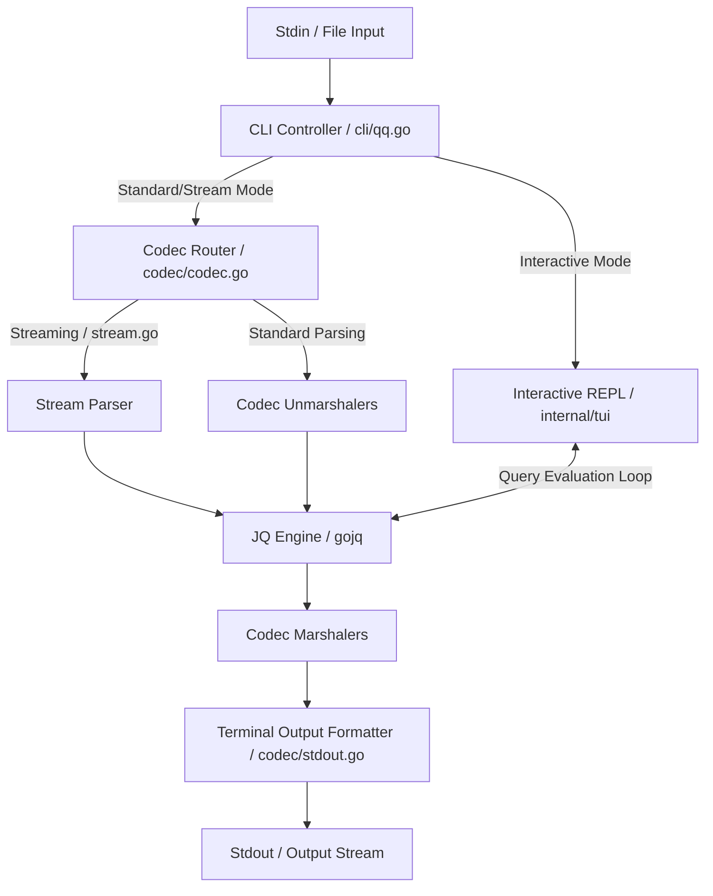
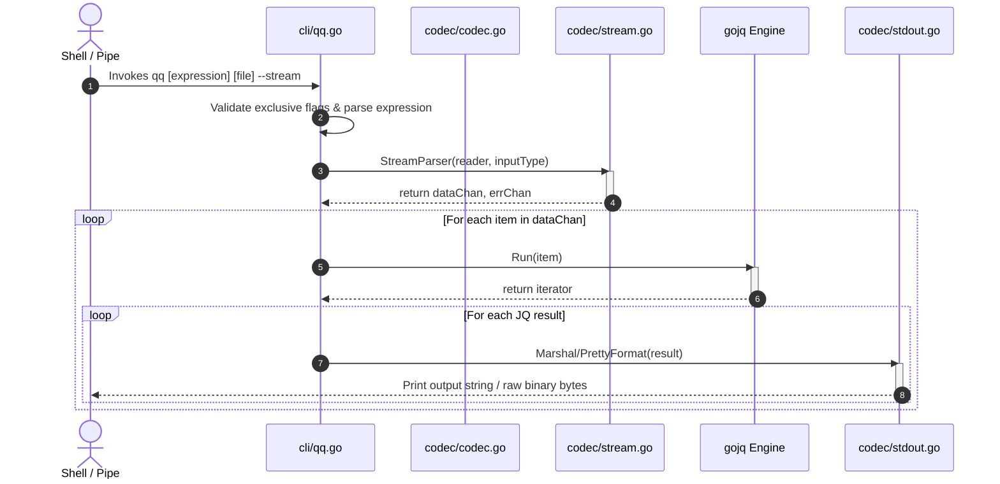
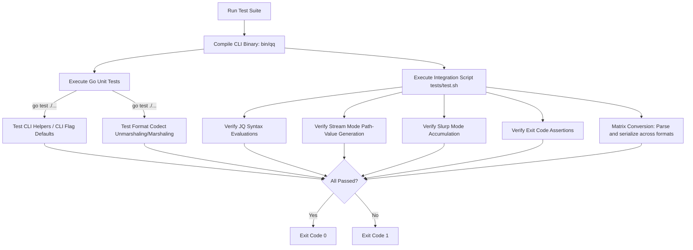

# Architecture Documentation

This document describes the architectural design, data flows, operational constraints, dependencies, security posture, and test suite verification of the `qq` application.

## Application Overview and Objectives

`qq` is a multi-format configuration transcoder and querying tool that embeds a JQ-compatible processor (`gojq`) to run queries on and convert between diverse data serialization formats. The tool serves as an interoperable alternative to standalone utilities like `jq`, `yq`, or `fq`, consolidating multi-format transformation capabilities into a single binary.

### Primary Objectives

1. **Format Interoperability**: Enable zero-overhead, format-agnostic data processing, allowing any supported configuration format to be ingested, queried, and emitted in another format.
2. **Standard Pipeline Compatibility**: Function natively within standard POSIX shell pipelines by operating on `stdin`/`stdout` streams, respecting exit statuses, and gracefully handling terminal signaling.
3. **Low Latency & High Throughput**: Minimize translation and query execution overhead, providing throughput comparable to format-specific native tools.
4. **Interactive Development Support**: Provide an interactive REPL with autocompletion and real-time visualization of JQ query evaluations over input payloads to assist developers in writing complex filters.

### Supported Encodings and Examples

The application supports 22 formats, categorized by their structural compatibility. Below is the full registry of supported codecs with a representative syntax example for each:

| Format Name | File Extensions | Read / Write | Group | Syntax / Structure Example |
| :--- | :--- | :---: | :---: | :--- |
| **JSON** | `.json` | Read / Write | `[H]` | `{"user": "alice", "id": 1}` |
| **YAML** | `.yaml`, `.yml` | Read / Write | `[H]` | `user: alice`<br>`id: 1` |
| **TOML** | `.toml` | Read / Write | `[H]` | `user = "alice"`<br>`id = 1` |
| **XML** | `.xml` | Read / Write | `[H]` | `<root><user>alice</user><id>1</id></root>` |
| **HCL / Terraform** | `.hcl`, `.tf` | Read / Write | `[H]` | `user { name = "alice" }` |
| **JSON Lines (NDJSON)**| `.jsonl`, `.ndjson` | Read / Write | `[H]` | `{"id": 1}`<br>`{"id": 2}` |
| **JSONC** | `.jsonc` | Read / Write | `[H]` | `{"id": 1} // comment` |
| **CBOR** | `.cbor` | Read / Write | `[H]` | *Binary serialized Object* |
| **MessagePack** | `.msgpack`, `.mpk` | Read / Write | `[H]` | *Binary compact serialization* |
| **Apache Avro** | `.avro` | Read / Write | `[H]` | *Binary schema-embedded OCF* |
| **Base64** | `.base64`, `.b64` | Read / Write | `[H]` | `eyJuYW1lIjogImFsaWNlIn0=` *(Base64 JSON)* |
| **CSV** | `.csv` | Read / Write | `[T]` | `user,id`<br>`alice,1` |
| **TSV** | `.tsv` | Read / Write | `[T]` | `user	id`<br>`alice	1` |
| **Apache Parquet** | `.parquet` | Read / Write | `[T]` | *Binary columnar table format* |
| **INI** | `.ini` | Read / Write | `[F]` | `[section]`<br>`user = alice` |
| **Environment Variables**| `.env` | Read / Write | `[F]` | `USER=alice`<br>`ID=1` |
| **Java Properties** | `.properties` | Read / Write | `[F]` | `user=alice`<br>`id=1` |
| **Gron** | `.gron` | Read / Write | `[F]` | `json.user = "alice";`<br>`json.id = 1;` |
| **HTML** | `.html` | Read / Write | `[H]` | `<html><body>alice</body></html>` *(Writes XML)* |
| **Line-delimited Text** | `.txt`, `.text`, `.line`| Read / Write | `[R]` | `alice`<br>`bob` *(Ingested as array of lines)* |
| **Protocol Buffers** | `.proto` | **Read-Only** | `[P]` | `message User { string name = 1; }` *(Returns AST)* |

---

## Architecture and Design Choices

`qq` is architected as a layered CLI application, written in Go. The codebase partitions its concerns into:
- Command-line parsing and entry point routing ([main.go](main.go) and [cli/qq.go](cli/qq.go)).
- The codec integration layer ([codec/codec.go](codec/codec.go)).
- Memory-bounded streaming routines ([codec/stream.go](codec/stream.go)).
- Semantic console rendering ([codec/stdout.go](codec/stdout.go)).
- The Interactive TUI REPL ([internal/tui/interactive.go](internal/tui/interactive.go)).



### Design Decisions

#### Modular Codec Routing
Rather than coupling format transformations, `qq` maps format extensions to an `Encoding` struct defining unmarshaling and marshaling strategies. This mapping is registered in [Codecs](codec/codec.go#L147).

#### Key Preservation Strategy
Standard Go map unmarshaling is non-deterministic and discards key order, sorting keys alphabetically during serialization. `qq` implements an order preservation mechanism. In [codec/util/order.go](codec/util/order.go), `util.SetKeyOrder` stores the key sequence of maps during unmarshaling, indexed by the memory pointer of the map representation:

```go
// codec/util/order.go: Pointer-based mapping for tracking original key order
var (
	keyOrderingMu sync.RWMutex                  // Read-write mutex securing concurrent access
	keyOrdering   = make(map[uintptr][]string)  // Maps memory pointer to ordered slice of keys
)

// SetKeyOrder saves the key order based on map's unsafe pointer address
func SetKeyOrder(ptr uintptr, keys []string) {
	keyOrderingMu.Lock()                  // Acquire exclusive lock
	keyOrdering[ptr] = keys               // Register key order for map pointer
	keyOrderingMu.Unlock()                // Release lock
}
```

During serialization, the JSON and YAML codecs call [GetKeyOrder](codec/util/order.go#L26). If the pointer matches, keys are emitted in their original sequence. If not, they default to alphabetical order.

#### Stream Processing Architecture
To avoid loading multi-gigabyte payloads into memory, [StreamParser](codec/stream.go#L15) implements an asynchronous producer-consumer loop. Formats are parsed sequentially, emitting path-value pairs into a buffered channel:

```go
// codec/stream.go: Channel-based asynchronous stream parsing
func StreamParser(reader io.Reader, inputType EncodingType) (<-chan any, <-chan error) {
	dataChan := make(chan any, 100)        // Buffered channel for parsed objects
	errChan := make(chan error, 1)          // Channel for error propagation

	go func() {                            // Run parser asynchronously in a goroutine
		defer close(dataChan)              // Ensure data channel closes on exit
		defer close(errChan)              // Ensure error channel closes on exit
		var err error
		switch inputType {
		case JSON:
			err = streamJSON(reader, dataChan)
		// Additional format routing omitted for brevity...
		}
		if err != nil {
			errChan <- err                 // Propagate error to consumer
		}
	}()
	return dataChan, errChan
}
```

### Key Assumptions

1. **Short Execution Lifespan**: Since the CLI tool runs as a transient utility, memory allocations (specifically the pointer-based map key ordering registry) are reclaimed on process exit. Long-running executions do not automatically prune the pointer cache unless [ClearKeyOrder](codec/util/order.go#L34) is explicitly triggered.
2. **Schema Invariance**: Binary formats (e.g., Avro, Proto) assume that incoming payloads are self-describing (e.g., Avro Object Container Files) or that structural parameters are provided.
3. **Interactive Mode JSON Dependency**: The TUI in [internal/tui/interactive.go](internal/tui/interactive.go) decodes its internal state buffer using `json.Unmarshal`. Using `--interactive` with output formats other than JSON causes unmarshaling failures in the query preview window since the data is marshaled into the target output format before initializing the TUI.
4. **Streaming Mode Output Serialization**: When running in `--stream` mode, output elements are always serialized and emitted as compact JSON lines (matching standard `jq --stream` behavior) regardless of the `-o` / `--output` flag setting.

### Edge Cases Handled

- **Early Pipeline Disconnections (SIGPIPE)**: If `qq` outputs to a downstream process that exits early (e.g. `qq ... | head -n 1`), the operating system raises a `SIGPIPE`. By default, Go terminates with code 141. `qq` catches this in `main.go` and exits with `0` to prevent pipeline failures:
  ```go
  // main.go: Prevent non-zero exits on standard pipe disconnections
  sigCh := make(chan os.Signal, 1)            // Buffer for incoming OS signal
  signal.Notify(sigCh, syscall.SIGPIPE)        // Register handler for SIGPIPE
  go func() {
      <-sigCh                                 // Block until SIGPIPE is received
      os.Exit(0)                              // Exit cleanly with code 0
  }()
  ```
- **Type Coercion Invalidation**: Parsers of text-based tabular data (CSV/TSV) or XML/INI automatically coerce strings resembling numbers or booleans (e.g., `"true"`, `"1.0"`) to primitive types. The `--no-auto-convert` flag overrides this in [ParseValue](codec/util/utils.go#L9) to preserve string values.
- **Top-Level Constraints**: Formats like TOML and INI require a top-level map structure. Passing a JQ primitive or array directly to these encoders returns an error.

### Performance and Efficiency

- **High-Performance JSON Handling**: Uses `github.com/goccy/go-json` for JSON parsing and rendering, which bypasses reflection overhead.
- **Constant Memory Footprint in Stream Mode**: Streaming mode processes inputs line-by-line or token-by-token (for JSON/YAML/CSV/TSV), keeping memory consumption low regardless of file size.
- **Lexer Token Caching**: In [PrettyFormat](codec/stdout.go#L14), syntax colorization uses the Chroma lexer fallback mechanisms to prevent repeated initialization overhead.

---

## Format Conversion Capabilities and Limitations

Because `qq` maps all format conversions through Go's standard runtime representation (maps, slices, and primitive scalars), structural incompatibilities between formats can impose translation constraints. These limits are enforced directly within the codec implementations:

### 1. Tabular Formats (CSV / TSV)
- **Serialization (Marshal)**:
  - The input data MUST be serialized as a flat slice of objects (`[]map[string]any`). Primitive values or arrays inside the root structure will raise a `"input data must be a slice"` or `"slice elements must be of type map[string]any"` error.
  - Values are converted to string representation using Go's `%v` fmt verb.
- **Deserialization (Unmarshal)**:
  - Discovers delimiters dynamically.
  - Automatically parses numeric and boolean strings into Go primitives, unless `--no-auto-convert` is set.

### 2. TOML
- **Numeric Normalization**:
  - Since JSON representations treat all numbers as `float64`, translating JSON-derived inputs to TOML directly would force integer properties to render as float representations (e.g. `120.0`). The TOML codec recursively normalizes floats: whole-numbered floats are cast back to `int64`.
- **Homogeneity Constraint**:
  - The TOML codec scans array structures to verify type consistency. If any element in an array is a non-whole float, all elements in that array are left as float values. This prevents the generation of mixed integer/float arrays which are illegal in TOML spec versions prior to 1.0.

### 3. XML
- **Structural Wrappers**:
  - XML documents require a single root element. If the internal map representation contains exactly one top-level key, that key is used as the XML root tag name. Otherwise, elements are wrapped in a default `<root>` element. Slices are wrapped under `<root>` or `<value>`.
- **Attributes and Text**:
  - Parsed XML attributes are map keys prefixed with `-`. Text child nodes in mixed content are stored under the key `#text`.

### 4. INI
- **Scope Restrictions**:
  - The INI codec ignores unnamed default section properties (properties defined before the first `[section]` tag) during unmarshaling.
  - Values nested deeper than two levels (e.g. `[section] -> key = value`) will be stringified using `%v`, as INI format does not support multi-level nested mapping natively.

### 5. Gron
- **Formatting Constraints**:
  - Gron deserialization is strictly line-by-line and expects the ` = ` delimiter (with spaces on both sides). Lines not conforming to this exact pattern will fail with a parsing format error.

### 6. Environment Variables (`.env`) & Java Properties (`.properties`)
- **Flat Mapping Constraint**:
  - Both `.env` and `.properties` codecs require a flat key-value map (`map[string]string`). Nesting objects or slices inside these formats will throw a `"format only supports simple key-value pairs, cannot convert complex nested structures"` error.

### 7. Protocol Buffers (`.proto`)
- **Read-Only**:
  - The Protocol Buffers codec only implements `Unmarshal`. It parses `.proto` syntax and generates a JSON-based abstract syntax tree (AST) mapping packages, messages, fields, and enums. Marshaling back to `.proto` text files is not supported (it will default to writing JSON representation of the AST).

### 8. HCL / Terraform
- **Wrapping & Type mapping**:
  - Inputs that are not top-level maps are wrapped in a map under the key `data`. Slices with length 1 containing maps are converted into HCL blocks, while other slices are mapped to `cty.TupleVal`. Non-scalar unsupported types are logged as warnings and skipped.

### Format Compatibility Matrix

The table below summarizes the compatibility rules and constraints when converting between format categories:

| Source Format | Destination Format | Allowed | Notes / Constraints |
| :--- | :--- | :--- | :--- |
| `[H] Hierarchical` | `[H] Hierarchical` | **Yes** | Fully compatible. Maps and slices translate directly. XML wraps rootless data in `<root>`, and TOML normalizes float representations. |
| `[H] Hierarchical` | `[T] Tabular` | **Conditional** | The hierarchical input must be structured as a flat slice of maps (`[]map[string]any`). Nested maps or arrays inside the slice elements will cause serialization errors. |
| `[H] Hierarchical` | `[F] Flat Key-Value` | **Conditional** | The input must be a single flat map (`map[string]any`) containing only scalar values. Nesting objects or slices will throw a validation error. |
| `[T] Tabular` | `[H] Hierarchical` | **Yes** | Translates the table rows into a JSON array of objects. Numeric, boolean, and date strings are coerced to primitives unless `--no-auto-convert` is set. |
| `[T] Tabular` | `[T] Tabular` | **Yes** | Direct translation of rows and columns. Delimiters are dynamically mapped. |
| `[T] Tabular` | `[F] Flat Key-Value` | **No** | Tabular arrays of rows cannot be mapped directly to flat key-value pairs without JQ filtering (e.g., selecting a single index `.[0]`). |
| `[F] Flat Key-Value` | `[H] Hierarchical` | **Yes** | INI, `.env`, and `.properties` files are parsed as flat JSON objects and can be serialized to any hierarchical target. |
| `[F] Flat Key-Value` | `[T] Tabular` | **No** | A single flat map cannot be serialized into table rows. Converting requires wrapping the map in an array via JQ (e.g. `[.]`). |
| `[F] Flat Key-Value` | `[F] Flat Key-Value` | **Yes** | Flat maps translate directly. INI ignores unnamed default section properties during unmarshaling. |
| `[R] Raw / Line` | Any Target | **Conditional** | Ingested as a slice of raw string lines. Can only be translated to structured schemas if processed via JQ filters to construct maps. |
| `[P] Protobuf Schema` | Any Target | **Yes** | Read-only schema. Parses `.proto` syntax into a JSON AST structure representing packages, messages, fields, and enums. |
| Any Format | `[P] Protobuf Schema` | **No** | The codec does not support serializing data structures back to `.proto` schema syntax (it will fallback to exporting a JSON AST). |

**Legend of Format Groups:**
- **`[H]` Hierarchical**: JSON (`.json`), YAML (`.yaml`/`.yml`), TOML (`.toml`), XML (`.xml`), HCL/Terraform (`.hcl`/`.tf`), CBOR (`.cbor`), MessagePack (`.msgpack`/`.mpk`), Avro (`.avro`), Base64 (`.base64`/`.b64`), JSON Lines/NDJSON (`.jsonl`/`.ndjson`/`.jsonlines`), JSONC (`.jsonc`).
- **`[T]` Tabular**: CSV (`.csv`), TSV (`.tsv`), Parquet (`.parquet`).
- **`[F]` Flat Key-Value**: INI (`.ini`), Environment Variables (`.env`), Java Properties (`.properties`).
- **`[R]` Raw / Line**: Line-delimited Text (`.txt`/`.text`, `.line`).
- **`[P]` Protobuf**: Protocol Buffers (`.proto`) (Schema definitions only).

---

## Data Flow and Control Logic

### Operational Flow

1. **Initialization**: [main.go](main.go) handles OS signals and passes execution to [CreateRootCmd](cli/qq.go#L18).
2. **Command and Flags Evaluation**: Cobra parses arguments in [handleCommand](cli/qq.go#L70). The parameters `--stream`, `--interactive`, and `--slurp` are verified for mutual exclusivity.
3. **Format Detection**:
   - If `-i` / `--input` is set, it overrides the auto-detection.
   - If not set and a file argument is provided, the input format is inferred from the extension via [inferFileType](cli/qq.go#L272).
   - Otherwise, the format defaults to JSON.
4. **Ingestion and Routing**:
   - **Stream Mode**: Invokes [executeStreamingQuery](cli/qq.go#L399). It launches a channel-based parser to execute the query concurrently.
   - **Interactive Mode**: Loads the entire dataset into memory, marshals it using the target output codec (which should be JSON or compatible due to TUI's internal JSON decoder), and calls [Interact](internal/tui/interactive.go#L334) to start the Bubbletea loop.
   - **Slurp Mode**: Processes all incoming values into an array using [slurpInputs](cli/qq.go#L332) before execution.
   - **Standard Mode**: Unmarshals the input using the selected codec.
5. **Execution & Rendering**: The JQ query is parsed and executed via `gojq.Query.Run`. Results are serialized by the output codec and printed. If the target is a terminal and `--monochrome-output` is false, the text is highlighted using Chroma in [PrettyFormat](codec/stdout.go#L14).

### Sequence Diagram



---

## Dependencies

The project relies on the following direct dependencies:

- **Command-line Interface**:
  - `github.com/spf13/cobra` (v1.10.2): Handles command-line arguments, flag parsing, and help text generation.
- **Query Evaluation Engine**:
  - `github.com/itchyny/gojq` (v0.12.19): Pure Go implementation of JQ, providing query parsing and execution.
- **Serialization and Codecs**:
  - `github.com/goccy/go-json` (v0.10.6): High-performance JSON parser.
  - `go.yaml.in/yaml/v4` (v4.0.0-rc.6): YAML encoder/decoder.
  - `github.com/BurntSushi/toml` (v1.6.0): TOML support.
  - `github.com/clbanning/mxj/v2` (v2.7.0): XML-to-Map unmarshaling and marshaling.
  - `github.com/hashicorp/hcl/v2` (v2.24.0) & `github.com/tmccombs/hcl2json` (v0.6.9): HCL/Terraform parser.
  - `github.com/fxamacker/cbor/v2` (v2.9.2): CBOR parser.
  - `github.com/hamba/avro/v2` (v2.31.0): Apache Avro decoder.
  - `github.com/apache/arrow/go/v16` (v16.1.0): Apache Parquet parsing.
  - `github.com/vmihailenco/msgpack/v5` (v5.4.1): MessagePack integration.
  - `gopkg.in/ini.v1` (v1.67.3): INI configuration support.
  - `golang.org/x/net` (v0.57.0): HTML parsing.
- **Interactive UI (TUI)**:
  - `github.com/charmbracelet/bubbletea` (v1.3.10): TUI lifecycle manager.
  - `github.com/charmbracelet/bubbles` (v1.0.0): Viewports and textareas.
  - `github.com/charmbracelet/lipgloss` (v1.1.0): Terminal layout styling.
- **Colorization and Terminal State**:
  - `github.com/alecthomas/chroma` (v0.10.0): Syntax highlighting.
  - `github.com/fatih/color` (v1.19.0): ANSI escape codes.
  - `github.com/mattn/go-isatty` (v0.0.22): TTY detection.

---

## Security Assessment

### 1. Encryption in Transit
`qq` is a local utility. It contains no network stack and does not perform network operations. Any network retrieval must be managed by external programs (e.g., `curl` or `wget`) before piping into `qq`.

### 2. Secret Management
The application processes data entirely in-memory and does not persist unmarshaled states to disk.
- **Risk**: Reading files containing sensitive credentials (e.g., `.env` or `.properties`) prints cleartext output to `stdout`.
- **Mitigation**: Users must prevent redirection of `stdout` to public logging systems or shared history files when handling sensitive configurations.

### 3. Authentication Configuration and RBAC
`qq` has no authentication engine or Role-Based Access Control (RBAC). It inherits the execution context and file permissions of the OS user executing the binary. File reads and writes are restricted by standard OS-level access control lists (ACLs).

### 4. Dependencies and Vulnerability Management
- All dependencies are tracked via Go modules (`go.mod` and `go.sum`).
- Building the binary requires Go `>= 1.25.0`.
- Third-party packages should be regularly audited using `govulncheck` to identify and update vulnerable dependencies.

### 5. Execution Context
`qq` runs in user space as an unprivileged process. It does not require administrator (root/SYSTEM) privileges. Standard deployments should avoid executing the binary with elevated permissions (`sudo` or Administrator command prompt) unless required to access specific system files.

---

## Code Quality Assessment

### Modularity
The codebase enforces a clear separation of concerns:
- [cli](cli) handles input validation, CLI flag parsing, and pipeline orchestration.
- [codec](codec) isolates translation logic, exposing a standard `Codec` interface to simplify adding new formats.
- [internal/tui](internal/tui) separates interactive REPL logic from standard CLI pipelines.

### Concurrency
[StreamParser](codec/stream.go#L15) implements an asynchronous producer-consumer pattern using Go channels. This decouples file reading from JQ engine execution, avoiding race conditions and limiting RAM consumption.

### Error Handling
The application uses strict error propagation:
- Codecs return errors to the CLI controller rather than calling `panic` or `os.Exit`.
- The CLI controller captures all errors and exits with a non-zero status code, ensuring predictable behavior in automation scripts.

### Map Key Order Preservation
Order preservation uses `uintptr` pointer hashing. Although pointer collision is theoretically possible if the garbage collector reuses memory addresses, it is highly unlikely to occur during the short lifespan of a CLI execution.

---

## Command Line Arguments

| Long Flag | Short Flag | Value Type | Default | Description |
| :--- | :--- | :--- | :--- | :--- |
| `--input` | `-i` | `string` | `"json"` | Specifies the input file format (required only when parsing from standard input). |
| `--output` | `-o` | `string` | `"json"` | Specifies the output file format by extension name. Inferred from extension if a file argument is provided. |
| `--raw-output` | `-r` | `bool` | `false` | Emits output strings directly without quotes or escape sequences. |
| `--interactive` | `-I` | `bool` | `false` | Launches interactive query builder mode (REPL). |
| `--monochrome-output`| `-M` | `bool` | `false` | Disables colored output and syntax highlighting. |
| `--stream` | | `bool` | `false` | Parses input in streaming mode, emitting path-value pairs to conserve memory. |
| `--slurp` | `-s` | `bool` | `false` | Reads multiple input values into a single array before executing the query. |
| `--exit-status` | `-e` | `bool` | `false` | Sets the exit code based on the query result (e.g., returns 1 if result is false/null, 4 if empty). |
| `--preserve-key-order`| `-k` | `bool` | `false` | Preserves map key ordering in JSON and YAML outputs. |
| `--no-auto-convert` | | `bool` | `false` | Disables automatic string type coercion during parsing. |
| `--help` | `-h` | `bool` | `false` | Displays help information. |
| `--version` | `-v` | `bool` | `false` | Displays the current version of `qq`. |

---

## Examples

### 1. Transcoding XML to TOML
Converts an XML structure to TOML representation.

```sh
# Command
cat data.xml | qq -i xml -o toml '.'
```

**Input (`data.xml`)**:
```xml
<config>
  <database>
    <host>127.0.0.1</host>
    <port>5432</port>
  </database>
</config>
```

**Output**:
```toml
[config]
  [config.database]
    host = "127.0.0.1"
    port = 5432
```

---

### 2. Tabular Transformation (CSV to JSON) with Order Preservation
Ingests CSV data and converts it to JSON while maintaining column order.

```sh
# Command
qq -k -i csv -o json '.' metrics.csv
```

**Input (`metrics.csv`)**:
```csv
metric_name,value,status
cpu_usage,84.5,active
memory_usage,62.1,active
```

**Output**:
```json
[
  {
    "metric_name": "cpu_usage",
    "value": 84.5,
    "status": "active"
  },
  {
    "metric_name": "memory_usage",
    "value": 62.1,
    "status": "active"
  }
]
```

---

### 3. Large Dataset Processing in Stream Mode
Streams path-value pairs from a JSON document to avoid loading the entire file into memory.

```sh
# Command
qq --stream 'select(length == 2)' large_payload.json
```

**Input (`large_payload.json`)**:
```json
{"id": 109, "tags": ["production", "database"]}
```

**Output**:
```json
[["id"],109]
[["tags",0],"production"]
[["tags",1],"database"]
[["tags"],1]
[]
```

---

### 4. Git Diff Integration (Gron representation)
Displays differences in configuration files by representing them as flattened paths.

```sh
# Command added to .gitconfig for textconv
qq --monochrome-output --output gron --input yaml config.yaml
```

**Input (`config.yaml`)**:
```yaml
app:
  port: 8080
  debug: true
```

**Output**:
```gron
json = {};
json.app = {};
json.app.debug = true;
json.app.port = 8080;
```

---

## Test Suite

The validation suite consists of:
1. Go unit and integration tests (executed via `go test`).
2. End-to-end integration shell tests (executed via [tests/test.sh](tests/test.sh)).

### Logic Flow of the Validation Suite



### Detailed Test Cases

#### 1. CLI Core Utility Tests ([cli/qq_test.go](cli/qq_test.go))
- `TestInferFileType`:
  - **Purpose**: Verifies that the file extension is correctly parsed to determine the format.
  - **Logic**: Maps extensions like `.json`, `.yml`, and `.tf` to their internal encoding types, and verifies that unknown formats default to JSON.
  - **Result**: PASS if mapping matches; FAIL otherwise.
- `TestIsFile`:
  - **Purpose**: Verifies helper identification of file assets vs directories.
  - **Logic**: Creates a temporary file, calls `isFile` on it, on a folder, and on a non-existent path.
  - **Result**: PASS if it correctly identifies files and directories; FAIL otherwise.
- `TestIsTerminal`:
  - **Purpose**: Detects interactive terminals to prevent terminal hangs on empty stdin.
  - **Logic**: Asserts that pipe outputs do not register as interactive terminals.
  - **Result**: PASS if pipe returns false; FAIL otherwise.

#### 2. End-to-End Pipeline Tests ([cli/integration_test.go](cli/integration_test.go))
- `TestE2E_Formats_JQExpressions`:
  - **Purpose**: Validates query evaluation across XML, YAML, CSV, TSV, and JSON.
  - **Logic**: Runs operations like array indexing, key lookup, and length checks on different input formats and checks the output.
  - **Result**: PASS if output matches the expected payload; FAIL otherwise.
- `TestE2E_KeyPreservation_Formats`:
  - **Purpose**: Validates that map key order is preserved across output formats.
  - **Logic**: Ingests CSV data and converts it to JSON, JSONL, CSV, TSV, YAML, and XML, verifying that columns retain their original order.
  - **Result**: PASS if order is preserved; FAIL otherwise.
- `TestE2E_DisableAutoConvert`:
  - **Purpose**: Validates that string auto-coercion is disabled under `--no-auto-convert`.
  - **Logic**: Compares default parsing (coercing values like `"T"` or `"1"` to boolean/number) against disabled auto-conversion (preserving values as strings) for CSV, XML, INI, and Gron.
  - **Result**: PASS if string values are preserved when auto-convert is disabled; FAIL otherwise.

#### 3. Stream & Slurp Validation ([cli/stream_test.go](cli/stream_test.go) & [cli/slurp_test.go](cli/slurp_test.go))
- `TestStreamParser`:
  - **Purpose**: Verifies stream parsing path-value generation.
  - **Logic**: Asserts that elements emitted to the stream channel are correctly formatted as array indices, map keys, and leaf values.
  - **Result**: PASS if the generated path-value pairs are correct; FAIL otherwise.
- `TestSlurpInputs_MultipleJSON`:
  - **Purpose**: Validates that multiple independent JSON values are slurped into a single array.
  - **Logic**: Feeds multiple lines of JSON into `slurpInputs` and checks if they are consolidated.
  - **Result**: PASS if the array contains all values; FAIL otherwise.

#### 4. Exit Code Assertions ([cli/slurp_test.go](cli/slurp_test.go))
- `TestExecuteQuery_ExitStatus_True` / `_False` / `_Null` / `_NoOutput`:
  - **Purpose**: Validates exit codes under the `-e` flag.
  - **Logic**: Asserts that queries returning `true` exit with code `0`, `false`/`null` exit with `1`, and queries with no matches exit with `4`.
  - **Result**: PASS if exit codes match JQ specifications; FAIL otherwise.

#### 5. Shell Integration Script ([tests/test.sh](tests/test.sh))
- `test_gojq_functionality`:
  - **Purpose**: Validates gojq syntax evaluation.
  - **Logic**: Tests filters like array slicing, conditionals, sorting, and string concatenation.
  - **Result**: PASS if shell evaluation output matches expected values; FAIL otherwise.
- **Conversion Matrix Tests**:
  - **Purpose**: Validates conversion compatibility between all supported formats.
  - **Logic**: Iterates over files in the `tests/` directory, converting each format to every other format (skipping unsupported conversions like Parquet-to-XML or binary format streams).
  - **Result**: PASS if conversions run successfully; FAIL otherwise.

### Build Process

The project enforces quality validation checks and constructs optimized, static binaries for target platforms.

#### 1. Automated Build
Automated compilation and local installation are orchestrated via the project `Makefile`. The `Makefile` dynamically detects the host operating system and compiles the target binary named `qq.exe` on Windows and `qq` on other platforms:
# Compile the default binary (resolves version dynamically using git)
make build

# Compile with a specific version override (e.g. for release pipelines)
make build VERSION=0.3.5-7ad8764

# Compile, test, and copy the binary to ~/.local/bin
make install
```

#### 2. Manual Build
For manual quality checking, custom targeting, and production cross-compilation, execute the following steps:

##### Code Quality & Security Audits
Prior to compilation, format the codebase, run static analysis, check for vulnerabilities, and scan for security issues:
```sh
go fmt ./...
golangci-lint run ./... --no-config
govulncheck ./...
gosec ./...
```

##### Compilation and Version Injection
Compile static, position-independent executables (PIE) with symbol table and debugging information stripped (`-s -w` flags), injecting version details directly into the `cli.Version` variable via `-ldflags`:
```sh
# Compile for Linux (AMD64) with version injection
GOOS=linux GOARCH=amd64 CGO_ENABLED=0 go build -v -ldflags "-s -w -X 'github.com/JFryy/qq/cli.Version=<version>'" -trimpath -buildmode=pie -o ./bin/

# Compile for Windows (AMD64) with version injection
GOOS=windows GOARCH=amd64 CGO_ENABLED=0 go build -v -ldflags "-s -w -X 'github.com/JFryy/qq/cli.Version=<version>'" -trimpath -buildmode=pie -o ./bin/

# Alternatively, for a simple manual build of the local platform binary (defaults to version "dev"):
go build -o bin/qq
```

### Running the Test Suite

Before running the test suite, ensure the binary has been compiled (e.g., using `make build` or `go build -o bin/qq main.go`).

#### 1. Run Go Tests
Run the Go unit and integration test suites:
```sh
go test -v ./...
```

#### 2. Run Integration Script
Run the bash integration script to verify CLI and format conversions:
```sh
bash tests/test.sh
```
